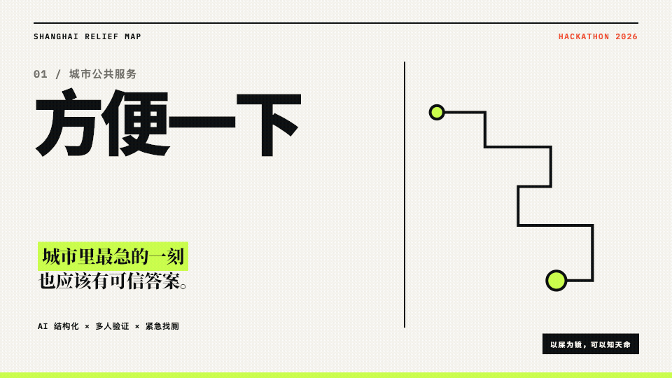

# 方便一下 · Shanghai Relief Map

> 上海不是没有厕所，而是缺一张理解“现在就要方便一下”的地图。

[](https://github.com/xuan-studio/fangbian-yixia/actions/workflows/ci.yml)
[](LICENSE)
[](https://lala.w3xuan.xyz/)

「方便一下」是一个 AI 结构化、社区多人验证驱动的上海厕所 3D 情报地图。公开地图告诉你“在哪里”，榜单线索告诉你“好不好”，用户现场反馈告诉你“现在能不能用”。真正着急时，系统会通过四级降级持续给出下一步，而不是假装数据永远完整。

*Fangbian Yixia is an AI-assisted, community-verified 3D restroom intelligence map for Shanghai. It combines open map data, curated venue clues, structured user feedback, and an emergency fallback flow.*

## 在线体验

- [打开产品](https://lala.w3xuan.xyz/)
- [查看 15 页交互路演](https://lala.w3xuan.xyz/slides/)

[](https://lala.w3xuan.xyz/slides/)

## 为什么不是普通厕所点评榜

- **941 个公开厕所点**：OpenStreetMap 上海数据，本地缓存并保留 ODbL 署名。
- **12 个优质场所线索**：平台证据、Mock 演示评论与用户评论分层，不生成无来源评分。
- **3D 城市地图**：配置后优先使用高德 Web JS API 2.0 的 3D 建筑底图；厕所点继续聚合显示，坐标自动转换为 GCJ‑02。高德不可用时回退 MapLibre + deck.gl，再失败则降级为离线概念地图。
- **四级紧急找厕**：从可信近厕逐步放宽条件，最后提供线下求助方案。
- **社区共建闭环**：评论由 AI 提取楼层、方位、设施和状态，经过 3 位独立用户确认后上线。
- **可信度分层**：体验评分、数据可信度和信息新鲜度独立展示。
- **娱乐型健康观察**：仅做趋势观察；便血、黑便、持续腹痛等红旗信号直接提示就医。

## 让 AI 帮你在电脑上运行

把下面这段话发给 Codex、Claude Code、Cursor 或其他可操作终端的 AI：

```text
请克隆 https://github.com/xuan-studio/fangbian-yixia.git，完整阅读仓库根目录的 AGENTS.md 和 AI-DEPLOY.md。检查 Node.js 版本后安装依赖，运行 lint 与测试，再启动本地开发服务。不要虚构厕所数据，不要把 Mock 评论当成真实证据，也不要把健康观察描述成医疗诊断。最后告诉我本地访问网址和测试结果。
```

完整步骤、Windows 命令、常见问题与 AI 安全边界见：[AI-DEPLOY.md](AI-DEPLOY.md)。

## 手动本地运行

需要 Node.js `22.13+ LTS` 或 Node.js 24，以及 npm。

```bash
git clone https://github.com/xuan-studio/fangbian-yixia.git
cd fangbian-yixia
npm ci
npm run dev
```

打开 `http://localhost:3000/`。首次启动不需要账号、数据库或 API Key。

### 可选：启用高德 3D 底图

在高德开放平台申请“Web 端（JS API）”Key 和安全密钥 `securityJsCode`，复制示例配置：

```bash
cp .env.example .env.local
```

在 `.env.local` 中填写 `AMAP_JS_KEY` 与 `AMAP_SECURITY_JS_CODE`，重新启动开发服务。安全密钥只由服务端代理使用；不要把 `.env.local`、Key 或安全密钥提交到 GitHub。没有配置时，项目会自动使用原有 MapLibre 地图。

验收：

```bash
npm run lint
npm test
```

`npm test` 会执行生产构建、3 项数据/离线契约测试和 3 项真实浏览器流程测试，覆盖地图、筛选、评论、共建、紧急降级、移动端和断网刷新。

## 数据与 AI 约定

- 统一厕所接口：[app/types.ts](app/types.ts)。
- JSON Schema：[public/data/toilet-record.schema.json](public/data/toilet-record.schema.json)。
- 缺失事实必须使用 `null`，界面显示“待核实”；未知不能写成“没有”。
- OpenStreetMap 未提供具体名称时，使用带来源编号的“无名公共厕所”占位名，并标记“名称待补充”，不得伪装成正式名称。
- 平台证据、Mock 评论和现场评论必须保留来源类型。
- 设施 Tag 词典与演示分配位于 [public/data/toilet-tag-taxonomy.json](public/data/toilet-tag-taxonomy.json)；绿色为已确认、金色为来源线索、紫色为 Mock 待验证，Mock 不参与紧急排序。
- 新厕所和楼内位置先进入候选池；未验证内容不得进入正式紧急推荐。
- 推广内容不得改变紧急模式的距离、开放状态和可用性排序。
- 不提交 Cookie、Token、个人定位或个体健康记录。

## 项目结构

| 路径 | 用途 |
| --- | --- |
| `app/Dashboard.tsx` | 地图、筛选、紧急推荐、评论、健康与共建中心 |
| `worker/index.ts` | 高德地图运行配置与安全代理、Slides 路由和站点入口 |
| `app/types.ts` | 数据契约和社区验证类型 |
| `public/data/` | 离线优先的公开点、榜单和候选数据 |
| `public/slides/` | 可在线或离线打开的路演分享版 |
| `slides/` | 路演可编辑源文件与图片资产 |
| `tests/` | 数据契约、浏览器流程、移动端和离线回归 |
| `docs/` | 项目介绍、60 分钟复演、QA 与办公小浣熊提示词 |

更多背景见：[项目完整介绍](docs/project-introduction.md) · [60 分钟复演](docs/60-minute-replay.md) · [贡献指南](CONTRIBUTING.md)。

## 许可与来源

- 项目原创代码使用 [MIT License](LICENSE)。
- OpenStreetMap 数据与其衍生数据库遵循 [ODbL](https://www.openstreetmap.org/copyright)，页面继续保留贡献者署名。
- 小红书等第三方平台的名称、链接、短摘录和图片仍属于各自权利人；MIT License 不覆盖第三方内容。
- 当前产品是黑客松原型，不提供实时排队、精确路线或医疗诊断。

欢迎提交 Issue 或 Pull Request。每一次可信贡献，都可能帮助下一位着急的人。
